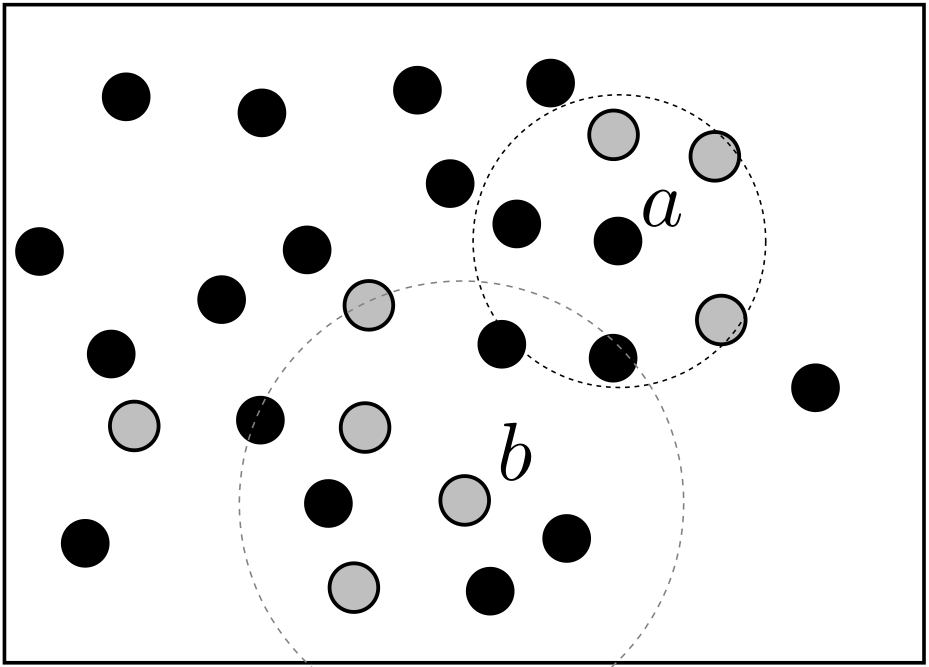

# Summary

TrixiParticles.jl is a Julia-based open-source package for particle-based multiphysics simulations and part of the Trixi Framework [@schlottkelakemper2020trixi]. It handles complex geometries and specialized applications, such as computational fluid dynamics (CFD) and structural dynamics, by providing a versatile platform for particle-based methods. TrixiParticles.jl allows for the straightforward addition of new particle systems and their interactions, facilitating the setup of coupled multiphysics simulations such as fluid-structure interaction (FSI). Furthermore, simulations are set up directly with Julia code, simplifying the integration of custom functionalities and promoting rapid prototyping.

Here, we give a brief overview of the software package TrixiParticles.jl, starting with the scientific background before going on to describe the functionality and benefit in more detail.
Finally, exemplary results and implemented features are briefly presented.

# Statement of need

Numerical simulations, such as CFD, structural mechanics, thermodynamics, or magnetohydrodynamics, pose several challenges when simulating real-world problems.
For example, they involve complex geometries, free surfaces,
deformable boundaries, and moving material interfaces, as well as the coupling of multiple systems with different mathematical models.

One way to address these challenges is to use particle-based methods, in which the particles either represent physical particles or mathematical interpolation points.
The former case refers to methods that model separate, discrete particles with rotational degrees of freedom such as the Discrete Element Method (DEM) proposed by [@Cundall:1979],
whereas the latter case refers to methods such as Smoothed Particle Hydrodynamics (SPH), which is a numerical discretization method for solving problems in continuum mechanics.
SPH was originally developed by [@Monaghan:1977] to simulate astrophysical applications and is now widely used to simulate CFD, structural mechanics, and even heat conduction problems.

The Lagrangian formalism in particle-based methods allows particles to move along a velocity field without any connection to neighboring particles,
thus eliminating the need for a mesh to discretize the simulation domain.
This mesh-free approach simplifies the preprocessing, making it particularly suitable for simulating complex geometries and also facilitates simulations of large deformations and movements.
By representing each material with its own set of particles,
coupling multiple different physical systems into a single multiphysics setup is straightforward.
In addition, particle-based methods are inherently suited to simulating free surfaces, material interfaces, and moving boundaries.

There are several open-source software projects specialized for SPH methods, including DualSPHysics [@Dominguez:2021], SPlisHSPlasH [@Bender], and SPHinXsys [@Zhang:2021],
written in C++, and  PySPH [@Ramachandran:2021], written in Python.
These softwares utilize the advantages of the SPH methods to simulate problems such as FSI and free surfaces [@O_Connor:2021] or complex geometries [@Laha:2024].

TrixiParticles.jl is written in the Julia programming language and combines the advantage of easy and rapid prototyping
with the ability for high-performance computing using multicore parallelization and hardware accelerators.
It provides support for developing and testing new SPH methods and also for simulating and coupling other particle-based methods such as DEM.
Since simulations are configured and set up using only Julia code, custom methods or particle interactions can be added without modifying the original source code.

# Overview of particle-based simulation

In TrixiParticles.jl, particles of a single particle-based method, e.g. SPH or DEM, are grouped into a \emph{system}.
The interaction between two particles is defined entirely by the types of their systems. This approach makes it easy to support new methods and different physics
by adding a new system and defining its pairwise interaction wth other systems.

{width=40%}

To illustrate this, \autoref{fig:systems} depicts particles within a simulation domain. The black particles belong to system $\mathcal{S}_1$ and the gray particles belong to system $\mathcal{S}_2$.
In general, the force $f_a$ experienced by a particle $a$ is calculated as
$$ f_a = \sum_{b \in \mathcal{S}_1} f_{ab}^{\mathcal{S}_1} + \sum_{b \in \mathcal{S}_2} f_{ab}^{\mathcal{S}_2} + \dots + \sum_{b\in \mathcal{S}_n}f_{ab}^{\mathcal{S}_n}, $$
where the interaction force $f_{ab}^{\mathcal{S}_i}$ that particle $a$ experiences due to particle $b$ depends on the system type of particle $a$, the system type $\mathcal{S}_i$ of particle $b$, and the relative particle distance.
For computational efficiency, only particles with a distance within a system-dependent search radius interact with each other.

For example, the SPH method determines the force between two SPH particles according to [@Monaghan:2005] as
$$ f_{ab} = -m_a m_b \left( \frac{p_a}{\rho_a^2} + \frac{p_b}{\rho_b^2} \right) \nabla_a W_{ab} + \Pi_{ab},$$
where $m_a$, $m_b$, $\rho_a$, $\rho_b$, $p_a$, $p_b$ are the mass, density, and pressure of particles $a$ and $b$, respectively. The last term $\Pi_{ab}$ includes dissipative terms such as artificial viscosity [@Monaghan:2005] and is scheme-specific. The weighting function $W_{ab}$, also called kernel-function, depends on the relative distance between particles $a$ and $b$.

# Code structure and features

\autoref{fig:structure} depicts the basic building blocks of TrixiParticles.jl. A simulation essentially consists of spatial discretization (left block) and time integration (center block). For the latter, the Julia package [OrdinaryDiffEq.jl](https://github.com/SciML/OrdinaryDiffEq.jl) is used. The callbacks (right block) provide additional functionality and communicate with the time integration method during the simulation.

The semidiscretization couples the systems of a simulation and also manages the corresponding neighborhood searches for each system.
The resulting ordinary differential equation (ODE) problem is then fed into the time integrator and is solved by an appropriate numerical time integration scheme.

{width=100%}

TrixiParticles.jl is open source and available under the MIT license at [GitHub](https://github.com/trixi-framework/TrixiParticles.jl),  along with detailed [documentation](https://trixi-framework.github.io/TrixiParticles.jl/stable/) on how to use it. Additionally, we provide tutorials explaining how to set up a simulation of fluid flows, structure mechanics, or FSI.
A collection of simulation setups to get started with can be found in the examples directory.

## Feature highlights

At the time of writing, the following feature highlights are available in TrixiParticles.jl:

* *Fluid Systems*
    + Weakly compressible SPH (WCSPH): Standard SPH method originally developed by [@Monaghan:1977] to simulate astrophysics applications.
    + Entropically damped artificial compressibility (EDAC) for SPH: As opposed to the WCSPH scheme, which uses an equation of state, this scheme uses a pressure evolution equation to calculate the pressure, which is derived by [@Clausen:2013] and adapted to SPH by [@Ramachandran:2019].

* *Structure Systems*
    + Total lagrangian SPH (TLSPH): Method to simulate elastic structures where all quantities are calculated with respect to the initial configuration [@O_Connor:2021].
    + DEM: Discretization of granular matter or bulk material into a finite set of distinct, interacting mass elements [@Bicanic:2004], [@Cundall:1979].

* *Boundary Systems*
    + Boundary system with several boundary models, where each model follows a different interaction rule.
    + Open boundary system to simulate non-reflecting (open) boundary conditions [@Lastiwka:2009].

* *Correction methods and models*
  + Density diffusion [@Antuono:2010]
  + Transport-velocity formulation (TVF) [@Adami:2013]
  + Intra-particle-force surface tension [@Akinci:2013]

* *Performance and parallelization*
  + Shared memory parallelism using multithreading
  + Highly optimized neighborhood search providing various approaches
  + GPU support

As a validation example, \autoref{fig:beam_y_deflection} compares simulation results of TrixiParticles.jl and [@O_Connor:2021] against the benchmark finite element method (FEM) data of [@Turek:2007].
The plots show the y-deflection of the tip of a beam oscillating under its own weight.
The results obtained with TrixiParticles.jl match those of [@O_Connor:2021] nearly perfectly.

![Comparison of TrixiParticles.jl and  [@O_Connor:2021] against [@Turek:2007]: Tip y-deflection of an oscillating beam with different resolutions, where $t_s$ is the thickness of the beam and $dp$ is the particle spacing. \label{fig:beam_y_deflection}](oscillating_beam.png){width=60%}

\autoref{fig:falling_sphere} illustrates an exemplary simulation result, where an elastic sphere, modeled with TLSPH, falls into a tank filled with water, modeled by WCSPH.

{width=100%}

# Acknowledgements

Sven Berger gracefully acknowledges funding from [hereon](https://www.hereon.de/) and [HiRSE](https://www.helmholtz-hirse.de/).

# References
